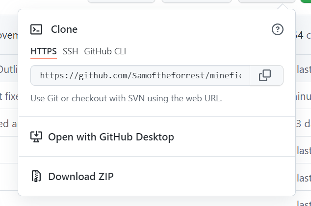

# Minefield Memory

## Goal For This Project

Welcome to Minefield Memory!

Trapped behind enemy lines, with a set of trecherous minefields ahead, how many of your comrades will you be able to save? Follow your captain, the ironically named Sgt M. Field to safety.

## Table of Contents
- [Minefield Memory](#minefield-memory)
  * [Goal For This Project](#goal-for-this-project)
  * [Table of Contents](#table-of-contents)
  * [UX/UI](#ux-ui)
    + [User Goals](#user-goals)
    + [User Stories](#user-stories)
    + [Site Owner's Goals](#site-owner-s-goals)
    + [User Requirements and Expectations](#user-requirements-and-expectations)
      - [Requirements](#requirements)
      - [Expectations](#expectations)
    + [Design Choices](#design-choices)
      - [Colours](#colours)
      - [Fonts](#fonts)
    + [Wireframes](#wireframes)
      - [Desktop Wireframes](#desktop-wireframes)
      - [Tablet Wireframes](#tablet-wireframes)
      - [Mobile Wireframes](#mobile-wireframes)
    + [UX/UI Flowchart](#ux-ui-flowchart)
  * [Features](#features)
    + [Existing Features](#existing-features)
    + [Features to be Implemented](#features-to-be-implemented)
  * [Technologies Used](#technologies-used)
    + [Languages](#languages)
    + [Frameworks](#frameworks)
    + [Design](#design)
  * [Testing](#testing)
    + [Responsivity](#responsivity)
    + [Select Difficulty](#select-difficulty)
    + [Increasing Difficulty](#increasing-difficulty)
    + [Movement Functionality](#movement-functionality)
    + [Updating Score](#updating-score)
    + [Get in Touch](#get-in-touch)
  * [Bugs](#bugs)
    + [Game Board Obscured by Social Icons on Laptop Screens](#game-board-obscured-by-social-icons-on-laptop-screens)
    + [Leader Moves Off the Game Board](#leader-moves-off-the-game-board)
    + [Player still able to move after getting to the final square](#player-still-able-to-move-after-getting-to-the-final-square)
    + [Player Able to Move During Leader's Turn](#player-able-to-move-during-leader-s-turn)
    + [Keydown event not resetting when the game resets](#keydown-event-not-resetting-when-the-game-resets)
  * [Deployment](#deployment)
    + [Local Development](#local-development)
    + [Deployment](#deployment-1)
  * [Credits](#credits)
    + [General Thanks](#general-thanks)

## UX/UI

### User Goals
- Website needs to be visually appealing.
- Ability to track your score as the game progresses.
- Ability to select difficulty, to choose the appropriate level of challenge.
- Once difficulty has been selected, difficulty then increments when each round is completed.
- Website needs to be functional on various devices (e.g. mobile, tablet and desktop).

### User Stories
- As a user, I should be able to play the game on both mobile and desktop devices.
- As a user, I would like to be able to select the game's difficulty.
- As a user, I would like the game's difficulty to increase slightly as the game progresses - to keep it engaging.
- As a user, I would like to be able to play the game using either using a keyboard or mouse/mobile clicks.
- As a user, I would like to be able to track my score as the game progresses.
- As a user, I would like to be able to contact the game's creator in order to provide feedback.

### Site Owner's Goals
- I would like to create a game that users find engaging.
- I wanted to create a game with features not usually found in standard memory games.
- I want users to be able to easily give feedback on the game - allowing me to revise the game and improve the user experience.
- I would like to create a game that is visually appealing.

### User Requirements and Expectations

#### Requirements
- Should be visually appealing
- Should be easily navigable - using either keyboard, mouse, or thumb click on mobile
- To track the user's score
- The ability for the user to select a difficulty
- To be able to change difficulty at any time

#### Expectations
- When a difficulty is selected, an appropriately difficult minefield should appear
- The user should only be able to move one sqaure at a time
- A tally of the score on screen for the user to keep track of
- The ability to return to the start of the game, and select a new difficulty using the 'home' link in the navigation
- That the rules modal appears when 'rules' is selected from the nav

### Design Choices

#### Colours
For this project - I chose a pre-made colour pallete from [Coolors](https://coolors.co/). I decided upon a simple, predominantly green, chromatic colour scheme because I believed that the simplicity was appropriate for the game's simple nature. I also thought that shades of green would be appropriate for a game based on minefields, as the colour is often associated with military uniform.

Below, I will go explain the individual colours' uses more carefully.

- `#1f2421`: As this colour is the darkest, I decided to use it mainly to outline, or as box shadow - note: there is another variant of this colour, with '80' added to the end. This sets the opacity of this colour to 50%.
- `#216869`: This colour was used as the main background of the page, as I felt that the other colours would stand out well against it.
- `#49a078`: I used this colour as the background for the following elements: the header, the game board container, and the social icons section.
- `#9cc5a1`: I initially used this colour as the background solely for the game board's squares. However, I decided that this colour wasn't aesthetically pleasing and decided to use this colour for the hover styling on the game's difficulty select buttons. 
- `#dce1de`: I used this colour for all of the text, as it provided the most contrast with the background.

#### Fonts
I used [Google Fonts](https://fonts.google.com/) to select the page's fonts. I used [Harmattan](https://fonts.google.com/specimen/Harmattan?query=harmat), in two different weights, for all of the game's text, as I thought it was inkeeping with the simple aesthetic.

### Wireframes

#### Desktop Wireframes
- [Home screen](docs/wireframes/desktop-home.png)
- [Game screen (easy)](docs/wireframes/desktop-easy-mode.png)
- [Game screen (medium)](docs/wireframes/desktop-medium-mode.png)
- [Game screen (hard)](docs/wireframes/desktop-hard-mode.png)
- [Game over screen](docs/wireframes/desktop-game-over.png)
- [Rules modal](docs/wireframes/desktop-rules.png)

#### Tablet Wireframes
- [Home screen](docs/wireframes/tablet-home.png)
- [Game screen](docs/wireframes/tablet-game-screen.png)
- [Game over](docs/wireframes/tablet-game-over.png)
- [Rules modal](docs/wireframes/tablet-rules.png)

#### Mobile Wireframes
- [Home screen](docs/wireframes/mobile-home.png)
- [Game screen](docs/wireframes/mobile-game-screen.png)
- [Game over](docs/wireframes/mobile-game-over.png)
- [Rules modal](docs/wireframes/mobile-rules.png)

### UX/UI Flowchart
- [UX/UI Flowchart](docs/uxui/flowchart/minefield-memory-uxui-flowchart.png)

[Back to top](#minefield-memory)

## Features

### Existing Features
- The ability to move using either keyboard (on desktop) or mouse/thumb clicks (on mobile devices)
- Ability to choose between three difficulty levels: easy, medium and hard
- Randomised paths through the minefield - meaning no two games are the same!
- The ability to provide feedback via social media (through links)
- Check the rules/how to play the game at any time by opening up the rules modal

### Features to be Implemented

**Hint**
- Add in a "hint" that checks whether the square right of, or below the player, has the "path" class on it, and changes the colour of the square to let the player know it is safe to walk on.

**Minesweeper Mode**
- Add in a version of the game in which there is no leader! As the player steps through the minefield, they have to hover their mouse over the surrounding squares to detect mines.
    - Add a note about how this would have to be a desktop only game because you cannot hover on smaller screen sizes.

**Multiplayer Mode**
- A version of the game in which one player is the "leader" - this player goes first and creates the path. Then, the second player has to copy the path exactly.

**Time-trial Mode**
- A version of the game which the user has to race against the clock to complete as many runs through the minefield as possible.

**Save High Scores**
- Allow users to save their highest score, and have an additional page in which displays a leaderboard of the highest scores of all players.

**Use Key and Click Movement Together**
- Allow users to, within a single round of the game, to use a combination of key and click movements to travel across the gameboard.

[Back to top](#minefield-memory)

## Technologies Used

### Languages
- [HTML](https://developer.mozilla.org/en-US/docs/Learn/Getting_started_with_the_web/HTML_basics)
- [CSS](https://developer.mozilla.org/en-US/docs/Web/CSS)
- [JavaScript](https://developer.mozilla.org/en-US/docs/Web/JavaScript)

### Frameworks
- [Bootstrap](https://getbootstrap.com/)

### Design
- [Figma](https://www.figma.com)
- [Font Awesome](https://fontawesome.com/)
- [Google Fonts](https://fonts.google.com/)

[Back to top](#minefield-memory)

## Testing

### Responsivity
**As a user, I should be able to play the game on both mobile and desktop devices.**
- **Plan**
I would like the page's layout to rearrange, based on the size of the device it is viewed on, in order to present the information in the most effect way possible.

- **Implementation**
I will use a combination of CSS media queries and Bootstrap classes in order to change the page's layout dependent on the user's device's viewport. I will base the CSS media queries on the default Bootstrap breakpoints.

- **Test**
I will use the [Chrome Developer Tools](https://developer.chrome.com/docs/devtools/) to resize the browser to emulate three mobile devices (Galaxy S20, iPhone SE and an iPad mini) and to ensure that the design is appropriate for each screen size.

- **Result**
The layout appeared as expected on all of the listed device sizes.

- **Verdict**
This test has been successful.

### Select Difficulty
**As a user, I would like to be able to select the game's difficulty.**
- **Plan**
When the game begins, the user will be presented with three buttons: easy, medium, and hard. Depending on which button the user clicks, a game board with a different amount of sqaures (based on the difficulty selected) will appear.

- **Implementation**
I created three buttons (using `<a>` tags) within the site's HTML. Within the JavaScript, I created an object that contains information about the different difficulties. I then selected all of the buttons using `document.querySelectorAll()`, iterrated over them using a forEach loop and added a click event listener to each button which runs the startGame function with an arugment set to the button's index in the forEach loop (0 is easy, 1 is medium, 2 is hard). This argument then corresponds to the difficulty object and determines what displays onscreen.

- **Test**
I will click on each of these buttons 5 times to see if the correct amount of squares are generated on the game board.

- **Result**
On each of the clicks, for all of the buttons, the correct amount of squares were generated and displayed onscreen.

- **Verdict**
This test has been successful.

### Increasing Difficulty
**As a user, I would like the game's difficulty to increase slightly as the game progresses - to keep it engaging.**
- **Plan**
Every time the user reaches the final square of the game board, the game will begin again, with the leader moving through the game board slightly faster than the previous game.

- **Implementation**
When the game begins, the leader's speed is determined by the `startingSpeed` key of the 'difficulties' object, which varies depending on the difficulty selected. As part of the logic for beginning a new round - in the `startNewRound` function - I multiplied the starting speed by 0.95.

- **Test**
I will add in a `console.log()` that displays the current speed of the leader every time the new round begins. I will complete three rounds on each difficulty to check if the number is getting smaller - but not too small - each round.

- **Result**
In every round of the game, the `console.log()` displayed a slightly lower number each time.

- **Verdict**
This test has been successful.

### Movement Functionality
**As a user, I would like to be able to play the game using either using a keyboard or mouse/mobile clicks.**
- **Plan**
When the game begins, the user should either be able to move using the keyboard's arrow keys or by clicking one of the squares next to the square that they are currently on (dependent on screen size).

- **Implementation**
On desktop, there is an event listener attached to the body containing an if statement that determines which key has been pressed and to where the player should move (based on the `currentPosition`) variable. On smaller screens, I have added logic that adds a click event listener to the squares currently surrounding the player, which when clicked on, updates the player's current position to the square clicked on.

- **Test**
For both the keyboard and click movement, I will move the player from one side of the board to the other - and discern whether the movement is working appropriately.

- **Result**
Although the keyboard movement did prove itself to be difficulty initially (as outlined in [bugs](#bugs)), I can confirm that -  both key and click movement - worked as expected for every attempt at crossing the game board.

- **Verdict**
This test has been successful.

### Updating Score
**As a user, I would like to be able to track my score as the game progresses.**
- **Plan**
As the player plays the game, for each successful round they complete the score should increment by 1.

- **Implementation**
Within the logic that checks if the player has successfully reached the final square and resets the game, I will include logic that increments the `score` variable, and set's the text content of the `
` with a class of 'score' to that value.

- **Test**
I will complete three rounds of the game myself, and check that the score increments appropriately. If it does, I will consider this test successful.

- **Result**
On each completed round, the score incremented appropriately.

- **Verdict**
This test has been successful.

### Get in Touch
**As a user, I would like to be able to contact the game's creator in order to provide feedback.**
- **Plan**
On the page, I would like to include links to my social media in the event that someone who play's the game would like to provide feedback.

- **Implementation**
On the bottom of the page, I have included three links to different social media accounts (Facebook, Instagram and Twitter) that when clicked, will open up the appropriate social media page in a new tab.

- **Test**
I will click each of these links 5 times, and check whether they take the user to the appropriate page.

- **Result**
Each of the clicks, to all three of the links, opened the appropriate page each time.

- **Verdict**
This test has been successful.

[Back to top](#minefield-memory)

## Bugs

### Game Board Obscured by Social Icons on Laptop Screens

- **Bug**
Because the social icons section has been absolutely positioned to the bottom of the screen, and the game board had a `min-height` set on it, this would cause overlapping between the two sections when the viewport height was less than the game board's `min-height` and the social icon's height together.

- **Fix**
To fix this, I removed the absolute positioning from the social icons, and set the heights of both the game area and the social icons area using `vh` units so that they never overflow from the screen. I also added a `min-height` value on to both of the areas to ensure that they would not shrink too small on certain devices.

- **Verdict**
I have tested this fix on two mobile devices (Samsung Galaxy S8 and iPhone SE), two tablet devices (iPad Mini and iPad Air), a laptop and a desktop and the sections are not overlapping. I have determined that this fix has been successful.

### Leader Moves Off the Game Board

- **Bug**
Because the leader's movement is dependent on on the `randomNumber` variable, the leader will sometimes move either off the bottom or the right of the screen.

- **Fix**
I implemented the following logic within the `determinePosition` function:

~~~
// this determines if the leader has reached the right edge of the board
if (leaderPosition % Math.sqrt(difficulty.squares) % Math.sqrt(difficulty.squares) === (Math.sqrt(difficulty.squares) - 1)) {
    console.log('right edge reached')
    updateLeaderPosition(Math.sqrt(difficulty.squares));
    return;
// this determines if the leader has reached the final row of the board
} else if (leaderPosition >= ((difficulty.squares) - (Math.sqrt(difficulty.squares)))) {
    console.log('bottom edge reached');
    updateLeaderPosition(1);
    return;
}
~~~
This logic forces the leader to only move down if it has reached the right edge of the board, or only right if it has reached the bottom row of the board. This is all based on the amount of squares generated, which is determined by the difficulties object.

- **Verdict**
I have ran the game five times on each difficulty, and the leader has successfully reached the final square each time and the appropriate console logs have fired at the correct time. I have determined that this fix has been successful.

### Player still able to move after getting to the final square

- **Bug**
When the player reaches the final square on the game board, they are still able to move before the round resets.

- **Fix**
Within the function used by the keyboard and mouse event listeners, I added an if statement that only allows the movement logic to be run if the player's position is not the final square.

- **Verdict**
I have successfully completed 3 trial runs (1 of each difficulty) of the game. Each time, when I reached the final square, I was no longer able to move the player icon. I have determined that this fix was successful.

### Player Able to Move During Leader's Turn

- **Bug**
After the leader's first turn, when the `keydown` event listener is added to the document, the player is able to move, which disrupts the leader's turn.

- **Fix**
Initially, I attempted to remove the `keydown` event listener at the end of the player's turn (when the player reaches the final square) - this was ineffective as a new event listener was added every round. To combat this, I added the `movementEnabled` variable, and included it within the player's movement logic - only allowing the player to move when the variable is set to true. During the leader's turn, the variable is set to false.

- **Verdict**
I played 5 rounds of the game, and during each of the leader's turns I continually pressed all of the buttons. The player was unable to move during the leader's turn. I have determined that this fix has been successful.

### Keydown event not resetting when the game resets

- **Bug**
[As mentioned above](#player-still-able-to-move-after-getting-to-the-final-square), for every round of the game, a new `keydown` listener was added to the document. Using the fix I implemented in the aforementioned solution meant the `keydown` listener only had the board information for the current difficulty mode. If the player resets the game, the `keydown` logic does not reset.

- **Fix**
To get the game to reset properly, I added `window.location.reload()` to the `resetGame` function. This refreshes the page whenever the function is run, which in turn removes the keydown event listener.

- **Verdict**
I used the reset button (the main title) and the 'play again' button five seperate times - making sure to switch to a new difficulty each time. On each occasion, the `keydown` listener was added correctly. I have determined this fix to be successful.

[Back to top](#minefield-memory)

## Deployment

### Local Development
I created this project using [GitHub](https://github.com/) to store the code and [Gitpod](https://www.gitpod.io/) as my code editor. To store my Gitpod code in GitHub, I used git commits followed by git pushing the code to the repository.

This project can be run locally by running the following steps:

1. Clone the project
  - Navigate to the [project repo](https://github.com/Samoftheforrest/minefield-memory)
  - Click the 'code' button (highlighted in the image below) - from here you have two options
  
    1. Open a terminal and run the following the command: `git clone https://github.com/Samoftheforrest/sawyl.git`
    2. Select 'download ZIP' to download a the files
    

2. Navigate to, and open, the cloned/downloaded folder in your code editor, through the following steps
  - File -> open folder
  - Navigate through your file directory to the place where the repo is cloned/downloaded
  - Select "open folder"
3. Run a live server using your preferred method - during the creation of this project, I used two different live server
  - [VScode Live Server](https://marketplace.visualstudio.com/items?itemName=ritwickdey.LiveServer) - this one is simple to run: right-click on the index.html file, and from the menu, select "open with live server"
  - Run a python live server with the following command `python3 -m http.server` - for this method, a python installation is required.

### Deployment

This page is deployed using [GitHub Pages](https://pages.github.com/). Here I will explain how to set up a GitHub Page:
1. Navigate to the main page of the project repo, and click the 'settings' tab.

2. On the following page, select 'pages' from the sidebar.

3. Make sure the branch is set to 'main' and the folder set to 'root' and click save to publish your GitHub page.

4. Following this, any time you commit and push to your repo, your GitHub page will automatically update.

[Back to top](#minefield-memory)

## Credits
- [This StackOverflow thread](https://stackoverflow.com/questions/10000083/javascript-event-handler-with-parameters) helped me to understand passing parameters to event listeners, which I implemented myself within the game's `playerMoves` function.
- [This StackOverflow thread](https://stackoverflow.com/questions/3715047/how-to-reload-a-page-using-javascript) showed me how to use JavaScript to refresh the page - which I used to solve [this issue](#keydown-event-not-resetting-when-the-game-resets)

### General Thanks
- I would like to thank my partner, Laura, for testing the site and suggesting improvements.
- I would like to thank my mentor [Simen](https://github.com/Eventyret) for his invaluable feedback on this project.

[Back to top](#minefield-memory)